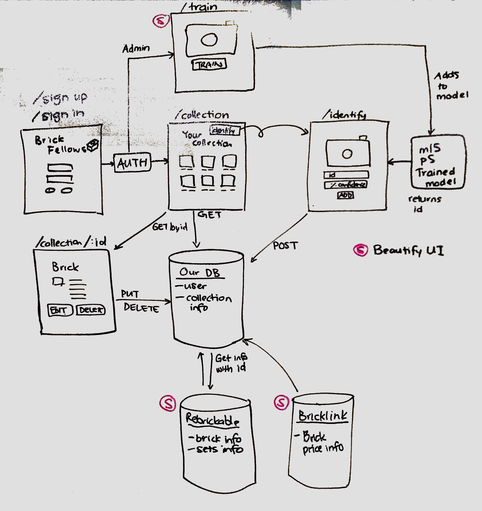

# Project Lego RESTful API

[View Current Deployment](https://project-lego.herokuapp.com/classify/)

## Overview
* This RESTful API provides the back-end functionality to create, read, update, and delete data related to lego bricks in a user's account. This provides users a way to identify and keep track of lego bricks they own. 

## Current Version
* The current version of this program is designed to create, read, update, and delete lego data that returns a user collection containing legos.
* The current version uses ml5.js and p5.js libraries to train the lego model to identify legos according to part number. 

#### Future Releases / Stretch Goals
* Return user leaderboard
* Pricing information for each lego part
* Store and return sets that the user could make based on their current lego collection

## Architecture

## Documentation
* [Jsdocs](https://project-lego.herokuapp.com/docs/) - Functions
* [Swagger Documentation](https://project-lego.herokuapp.com/api-docs) - Route Documentation

## Setting up locally
##### In .env file
* PORT: defaults to 3000
* SECRET: for express secret
* KEY: key obtained from rebrickable.com
* TOKEN_LIFETIME: how long a user token lasts for, defaults to 120 minutes
* MONGODB_URI: location of local mongo database

##### Running
* run `npm i`
* run `npm start` or `nodemon`
* open new browser window, `localhost:3000`

## Testing
* Unit tests were done with jest -  `npm run test`
* Lint tests were done with eslint - `npm run lint`
* Travis CI is integrated with .travis.yml file

